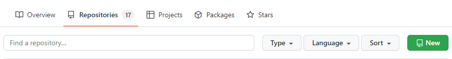
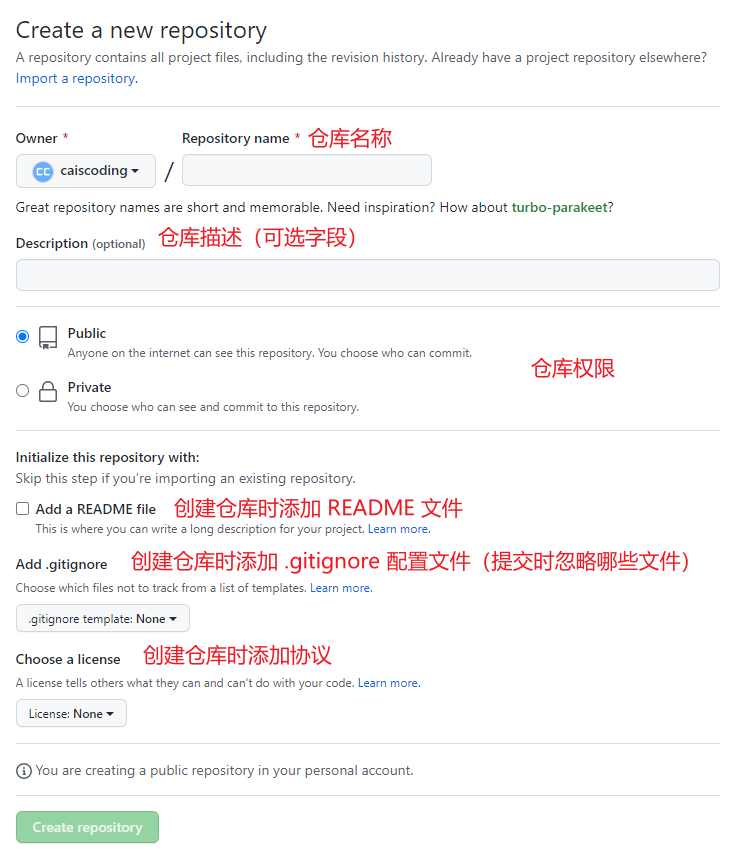
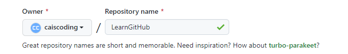
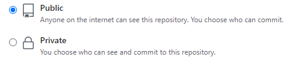
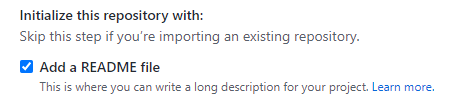
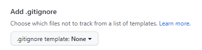
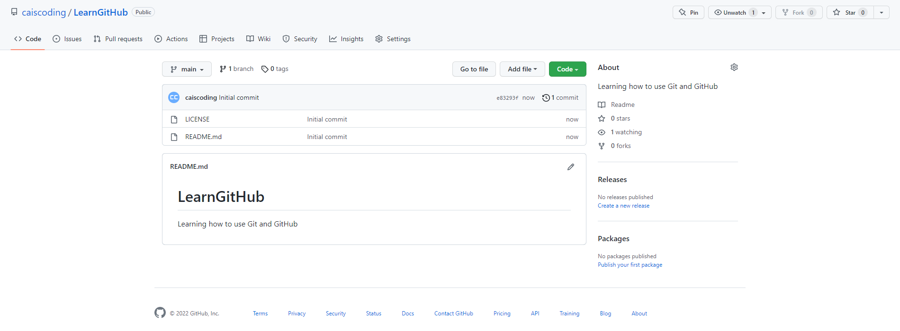
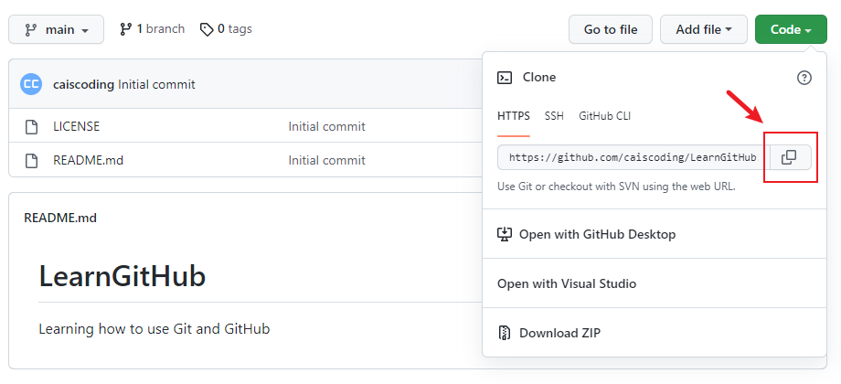
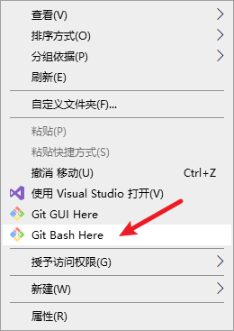

# LearnGitHub

Learning how to use Git and GitHub

## 创建 GitHub 账户

进入 [GitHub](https://github.com/) 主页，点击右上角的 `Sign up` 进行注册，进入注册页面，按照指引填写邮箱和密码等相关信息。

## 安装 Git

[Git 下载地址](https://git-scm.com/downloads)

## 本地计算机 Git 设置

### 设置用户名

```sh
$ git config --global user.name "Your GitHub User Name"
```

### 设置邮箱

```sh
$ git config --global user.email "Your GitHub Email"
```

### 设置密码

```sh
$ git config --global user.password "Your GitHub User SSH Key"
```

### 设置 http 代理

```sh
$ git config --global http.proxy http://127.0.0.1:1080
```

### 设置 https 代理

```sh
$ git config --global https.proxy http://127.0.0.1:1080
```

### 设置 socks 代理

```sh
$ git config --global http.proxy 'socks5://127.0.0.1:1080'
```

```sh
$ git config --global https.proxy 'socks5://127.0.0.1:1080'
```

### 取消代理

```sh
$ git config --global --unset http.proxy
```

```sh
$ git config --global --unset https.proxy
```

### 设置 UI 显示颜色

```sh
$ git config --global color.ui auto
```

最后配置将保存在 `~/.gitconfig` 文件中。

## GitHub 创建仓库

点击主页 `Repositories` ，在该页面点击 `New` 按钮创建仓库。



来到创建仓库页面，该页面可以配置仓库的相关信息。



**Repository name**

该字段为仓库的名称，同一用户不能存在两个同名仓库。例如这里我们填写仓库名称 `LearnGitHub` ：



**Description**

该字段为此仓库的描述，该字段是可选字段，可以不填写。例如这里我们填写仓库描述 `Learning how to use Git and GitHub` ：


**Privileges**

权限字段有两个选择：

- `Public` ：该权限允许互联网上的任何人看到这个仓库，用户所有者可以选择某个人可以提交代码至该仓库。
- `Private` ：该权限只允许你可以选择特定人可以看到和提交代码到这个仓库。

例如这里我们选择 `Public` ：



**Add a README file**

该选项如果被勾选， GitHub 在创建该仓库时会自动初始化仓库并添加 `README.md` 文件，让用户可以立刻 `clone` 这个仓库。

注意：如果你想向 GitHub 添加已有的 Git 仓库，建议不要勾选此项，而是直接手动 `push` 。

例如这里我们勾选此项：



**Add .gitignore**

这个选项可以让 GitHub 在初始化仓库时创建一个 `.gitignore` 文件，这个文件可以设置我们不需要在 Git 仓库中进行版本管理的文件记录。下拉菜单中包含了主要的语言和框架。

但这里我们不做选择：



**Choose a license**

这个选项可以选择仓库的许可协议文件，如果你确定了当前仓库的许可协议，在这里就做好选择， GitHub 在初始化仓库时就会自动添加选择的协议 `LICENSE` 文件。

例如这里我们选择 `GNU GPL v3.0` 协议：


最后我们点击 `Create repository` 就可以完成仓库的创建，创建完成后会自动进入刚刚创建仓库的主页：



## clone 已有仓库

接着我们点击仓库右上角的 `Code` 按钮，点击当前仓库链接旁的 `复制` 按钮，这样我们就复制了当前仓库的链接。



接着我们来到本地计算机，选择一个放置仓库文件的位置，右键选择 `Git Bash Here` 打开 `Git Bash` ：



使用以下命令我们可以 `clone` 仓库：

```sh
$ git clone <GitHub Link>
```

例如我们这里键入

```sh
$ git clone https://github.com/caiscoding/LearnGitHub.git
```

回车执行此命令显示一些相关信息：

```sh
Cloning into 'LearnGitHub'...
remote: Enumerating objects: 4, done.
remote: Counting objects: 100% (4/4), done.
remote: Compressing objects: 100% (3/3), done.
remote: Total 4 (delta 0), reused 0 (delta 0), pack-reused 0
Receiving objects: 100% (4/4), 12.48 KiB | 2.50 MiB/s, done.
```

就这样我们 `clone` 了刚刚创建的仓库。

## 查看仓库状态

进入刚刚 `clone` 到本地计算机的仓库中，在仓库中添加 `index.html` 文件，文件内容如下：

```html
<!DOCTYPE html>
<html>
	<head>
		<meta charset="utf-8">
		<title>Title</title>
	</head>
	<body>
	TEXT
	</body>
</html>
```

使用下面的命令查看仓库状态：

```sh
$ git status
```

可以看到显示如下信息：

```sh
On branch main
Your branch is up to date with 'origin/main'.

Untracked files:
  (use "git add <file>..." to include in what will be committed)
        index.html

nothing added to commit but untracked files present (use "git add" to track)
```

可以看到显示信息为 `Untracked files` ，即有一个名为 `index.html` 没有被追踪。

## 添加至本地仓库暂存区

使用以下命令可以添加文件至本地仓库暂存区：

```sh
$ git add <file name>
```

接着执行以下命令将我们刚刚添加的 `index.html` 文件添加到本地仓库暂存区：

```sh
$ git add index.html
```

## 添加至本地仓库

使用以下命令可以提交文件至本地仓库：

```sh
$ git commit -m "commit message"
```

接着执行以下命令将我们刚刚添加到暂存区的 `index.html` 文件提交到本地仓库：

```sh
$ git commit -m "add index.html"
```

```sh
[main ab3e8a7] add index.html
 1 file changed, 10 insertions(+)
 create mode 100644 index.html
```

## 查看提交日志

使用以下命令可以查看提交日志：

```sh
$ git log
```

我们查看提交日志如下：

```sh
commit ab3e8a77f7a8b4697c74b225e73f2587b01d4bec (HEAD -> main)
Author: caiscoding <caiscoding@yeah.net>
Date:   Tue Jun 14 23:00:35 2022 +0800

    add index.html

commit e83293f485749497d5c493334a1bb4e0e1692394 (origin/main, origin/HEAD)
Author: caiscoding <caiscoding@yeah.net>
Date:   Tue Jun 14 22:11:02 2022 +0800

    Initial commit
```

## 提交代码至 GitHub

使用以下命令可以将仓库修改提交至 GitHub ：

```sh
$ git push
```

执行后显示信息如下：

```sh
Enumerating objects: 4, done.
Counting objects: 100% (4/4), done.
Delta compression using up to 8 threads
Compressing objects: 100% (3/3), done.
Writing objects: 100% (3/3), 395 bytes | 197.00 KiB/s, done.
Total 3 (delta 0), reused 0 (delta 0), pack-reused 0
To https://github.com/caiscoding/LearnGitHub.git
   e83293f..ab3e8a7  main -> main
```

## 初始化仓库

使用以下命令可以初始化仓库：

```sh
$ git init
```

注意，在执行以上命令前，必须创建一个目录，并且目录名为仓库名，进入该目录后才执行此命令。

例如我们创建一个名为 `github-tutorial` 的目录，进入目录后执行初始化命令：

```sh
$ git init
Initialized empty Git repository in D:/Projects/github-tutorial/.git/
```

执行命令后，在当前目录下就会生成一个 `.git` 目录，该目录存储的是管理当前仓库所需要的数据。

接着我们可以执行查看状态命令查看当前仓库的状态：

```sh
$ git status
On branch master

No commits yet

nothing to commit (create/copy files and use "git add" to track)
```

可以看到输出的信息显示我们当前在 `master` 分支下，没有可以提交的内容。

这里我们创建一个空白的 `README.md` 文件，然后查看当前仓库状态：

```sh
$ git status
On branch master

No commits yet

Untracked files:
  (use "git add <file>..." to include in what will be committed)
        README.md

nothing added to commit but untracked files present (use "git add" to track)
```

可以看到提示有 `Untracked` 文件 `README.md` ，向上面一样，我们使用命令向仓库暂存区添加该文件：

```sh
$ git add README.md
```

然后使用命令查看当前仓库的状态：

```sh
$ git status
On branch master

No commits yet

Changes to be committed:
  (use "git rm --cached <file>..." to unstage)
        new file:   README.md
```

可以看到在 `master` 分支中，没有需要提交到暂存区的文件，刚刚的 `README.md` 文件被列在 `Changes to be committed` 中了，提示我们可以进行提交。

接着，我们将暂存区的文件进行提交：

```sh
$ git commit -m "add README.md"
[master (root-commit) 7db7e89] add README.md
 1 file changed, 0 insertions(+), 0 deletions(-)
 create mode 100644 README.md
```

这里的 `-m` 参数为提交信息，可以添加对当前提交的描述。

当然，我们可以不添加这个参数，执行上面的命令会显示以下结果：

```sh
# Please enter the commit message for your changes. Lines starting
# with '#' will be ignored, and an empty message aborts the commit.
# On branch master
#
# Initial commit
#
# Changes to be committed:
#   (use "git rm --cached <file>..." to unstage)
#
#        new file:   README.md
#
```

我们可以记录更加详细的提交信息，这里记录的提交信息格式如下：

- 第一行：用一行文字简述提交的更改内容
- 第二行：空行
- 第三行以及之后的行：记录更改的原因和详细内容

按照上面的格式进行输入，我们以后可以通过确认日志的命令或者工具查看这些记录。

接着我们继续查看仓库状态：

```sh
$ git status
On branch master
nothing to commit, working tree clean
```

因为刚刚已经完成了提交，所以结果显示没有任何更改以及需要提交的文件。

同理我们可以查看提交日志：

```sh
$ git log
commit 7db7e89ead9f96634154673c2fa8ff0fdefdb69c (HEAD -> master)
Author: caiscoding <caiscoding@yeah.net>
Date:   Tue Jun 14 23:23:53 2022 +0800

    add README.md
```

- `commit` 显示的是指向这个提交的哈希值
- `Author` 显示用户名和邮箱地址。
- `Date` 显示提交执行的日期和时间。
- 下面就是该提交的提交信息。

## 指定显示提交信息的第一行

使用 `--pretty=short` 可以只让提交信息显示一行：

```sh
$ git log --pretty=short
```

执行后显示信息如下：

```sh
commit 7db7e89ead9f96634154673c2fa8ff0fdefdb69c (HEAD -> master)
Author: caiscoding <caiscoding@yeah.net>

    add README.md
```

## 指定显示目录或文件的日志

在命令后面添加目录名或文件名能显示特定目录或文件的日志：

```sh
$ git log <file/folder name>
```

## 显示文件的更改情况

使用 `-p` 参数可以显示文件提交前后的差别：

```sh
$ git log -p
```

在该命令后面添加文件名可以查看特定文件提交前后的差别：

```sh
$ git log -p <file/folder name>
```

## 查看工作树和暂存区之间的差别

使用下面的命令可以查看工作树、暂存区、最新提交之间的差别：

```sh
$ git diff
```

例如，我们在刚刚的空白 `README.md` 文件中写入 `# Learn Git and GitHub` 内容，然后执行该命令，会有以下的提示信息：

```sh
diff --git a/README.md b/README.md
index e69de29..e25f8b5 100644
--- a/README.md
+++ b/README.md
@@ -0,0 +1 @@
+# Learn Git and GitHub
\ No newline at end of file
```

可以看到这里显示了我们刚刚新添加的行， `+` 号标出了新添加的行， `-` 号标出了删除的行。

接着我们把这个修改添加到暂存区中：

```sh
$ git add README.md
```

继续执行 git diff 命令，会发现什么都没显示，因为现在工作树和暂存区之间是没有差别的。

## 查看工作树和最新提交之间的差别

现在我们执行以下命令查看工作树和最新提交之间的差别：

```sh
$ git diff HEAD
```

我们能看到差别信息如下：

```sh
diff --git a/README.md b/README.md
index e69de29..e25f8b5 100644
--- a/README.md
+++ b/README.md
@@ -0,0 +1 @@
+# Learn Git and GitHub
\ No newline at end of file
```

然后我们执行提交命令：

```sh
$ git commit -m "add README.md title"
[master ec1a450] add README.md title
 1 file changed, 1 insertion(+)
```

我们可以执行查看日志命令查看是否提交成功：

```sh
$ git log
commit ec1a450b7bc7a0fac91a16eb3b1f176dba157d7c (HEAD -> master)
Author: caiscoding <caiscoding@yeah.net>
Date:   Wed Jun 15 00:39:51 2022 +0800

    add README.md title

commit 7db7e89ead9f96634154673c2fa8ff0fdefdb69c
Author: caiscoding <caiscoding@yeah.net>
Date:   Tue Jun 14 23:23:53 2022 +0800

    add README.md
```

# 分支

`master` 分支是 Git 默认创建的分支，当然我们也可以自定义设置默认分支。分支也可以合并。

## 显示所有分支

使用下面的命令可以显示所有的分支：

```sh
$ git branch
```

例如在刚刚上面的仓库中执行该命令显示如下：

```sh
$ git branch
* master
```

因为该项目只有一个 `master` 分支，所以只显示了该分支，并且分支名称左侧的 `*` 号表示了我们当前所在的分支。

## 创建分支

使用下面的命令可以创建一个新的分支：

```sh
$ git branch <branch name>
```

例如我们在当前项目创建一个 `branch-a` 分支：

```sh
$ git branch branch-a
```

然后我们查看所有分支：

```sh
$ git branch
  branch-a
* master
```

## 切换分支

使用下面的命令可以切换分支：

```sh
$ git checkout <branch name>
```

我们把当前项目切换到新创建的分支：

```sh
$ git checkout branch-a
Switched to branch 'branch-a'
```

执行命令后显示我们正处于新创建的分支下：

```sh
$ git branch
* branch-a
  master
```

当然，为了方便，我们可以把上面的两个命令合成为一步进行，只需要执行下面的命令就能创建并切换到新分支：

```sh
$ git checkout -b <branch name>
```

接着，我们在 `branch-a` 分支下修改 `README.md` ，在文件中添加新的一行 `branch-a` ，然后提交到暂存区：

```sh
$ git add README.md
$ git commit -m "add branch-a"
[branch-a 2059ba4] add branch-a
 1 file changed, 2 insertions(+), 1 deletion(-)
```

接着，我们切换到 `master` 分支：

```sh
$ git checkout master
Switched to branch 'master'
```

查看 `README.md` 文件，发现其并没有受到影响。

接着我们切换到 `branch-a` 分支：

```sh
$ git checkout -
Switched to branch 'branch-a'
```

使用 `-` 代替分支名可以切换到上一个分支。

## 合并分支

合并分支时，我们需要切换到要合并到的主干分支中。

例如我们现在要将 `branch-a` 合并到 `master` 分支中，就要切换回 `master` 分支：

```sh
$ git checkout master
Switched to branch 'master'
```

然后执行下面的命令把 `branch-a` 分支合并到 `master` 分支：

```sh
$ git merge --no-ff branch-a
```

执行上面的命令时，会启动一个编辑器，该编辑器用于录入合并分支提交的信息：

```sh
Merge branch 'branch-a'
# Please enter a commit message to explain why this merge is necessary,
# especially if it merges an updated upstream into a topic branch.
#
# Lines starting with '#' will be ignored, and an empty message aborts
# the commit.
```

当然我们也可以不做修改，直接保存，并退出编辑器，就会看到以下的结果：

```sh
Merge made by the 'ort' strategy.
 README.md | 3 ++-
 1 file changed, 2 insertions(+), 1 deletion(-)
```

这样就说明合并完成了，我们可以查看 `README.md` 文件，会发现在 `branch-a` 修改的内容在 `master` 分支也修改了。

## 删除分支

使用以下命令可以删除特定分支：

```sh
$ git branch -D <branch name>
```

## 以图表形式查看分支

可以执行以下命令以图表的形式查看分支：

```sh
$ git log --graph
```

在当前仓库执行上述命令结果如下：

```sh
*   commit a91ac6bd1743787430a32ef6594d0a12b62deda7 (HEAD -> master)
|\  Merge: ec1a450 2059ba4
| | Author: caiscoding <caiscoding@yeah.net>
| | Date:   Wed Jun 15 01:58:22 2022 +0800
| |
| |     Merge branch 'branch-a'
| |
| * commit 2059ba4148b11f24a9c0ed010d85e95e9195860c (branch-a)
|/  Author: caiscoding <caiscoding@yeah.net>
|   Date:   Wed Jun 15 01:52:22 2022 +0800
|
|       add branch-a
|
* commit ec1a450b7bc7a0fac91a16eb3b1f176dba157d7c
| Author: caiscoding <caiscoding@yeah.net>
| Date:   Wed Jun 15 00:39:51 2022 +0800
|
|     add README.md title
|
* commit 7db7e89ead9f96634154673c2fa8ff0fdefdb69c
  Author: caiscoding <caiscoding@yeah.net>
  Date:   Tue Jun 14 23:23:53 2022 +0800
```

# 更改提交的操作

## 回溯历史版本

使用下面的命令可以回溯历史版本：

```sh
$ git reset --hard <hash code>
```

接着上面的例子，我们回溯到创建 `branch-a` 分支之前，再创建一个 `branch-b` 分支，首先查看提交日志：

```sh
$ git log --graph
*   commit a91ac6bd1743787430a32ef6594d0a12b62deda7 (HEAD -> master)
|\  Merge: ec1a450 2059ba4
| | Author: caiscoding <caiscoding@yeah.net>
| | Date:   Wed Jun 15 01:58:22 2022 +0800
| |
| |     Merge branch 'branch-a'
| |
| * commit 2059ba4148b11f24a9c0ed010d85e95e9195860c (branch-a)
|/  Author: caiscoding <caiscoding@yeah.net>
|   Date:   Wed Jun 15 01:52:22 2022 +0800
|
|       add branch-a
|
* commit ec1a450b7bc7a0fac91a16eb3b1f176dba157d7c
| Author: caiscoding <caiscoding@yeah.net>
| Date:   Wed Jun 15 00:39:51 2022 +0800
|
|     add README.md title
|
* commit 7db7e89ead9f96634154673c2fa8ff0fdefdb69c
  Author: caiscoding <caiscoding@yeah.net>
  Date:   Tue Jun 14 23:23:53 2022 +0800
```

然后执行刚刚介绍的命令回溯历史版本：

```sh
$ git reset --hard ec1a450b7bc7a0fac91a16eb3b1f176dba157d7c
HEAD is now at ec1a450 add README.md title
```

再次查看历史提交日志如下：

```sh
$ git log --graph
* commit ec1a450b7bc7a0fac91a16eb3b1f176dba157d7c (HEAD -> master)
| Author: caiscoding <caiscoding@yeah.net>
| Date:   Wed Jun 15 00:39:51 2022 +0800
|
|     add README.md title
|
* commit 7db7e89ead9f96634154673c2fa8ff0fdefdb69c
  Author: caiscoding <caiscoding@yeah.net>
  Date:   Tue Jun 14 23:23:53 2022 +0800

      add README.md
```

接着我们创建 `branch-b` 分支：

```sh
$ git checkout -b branch-b
Switched to a new branch 'branch-b'
```

同样在该分支中的 README.md 文件中写入 `branch-b` 内容，然后提交：

```sh
$ git add README.md
$ git commit -m "add branch-b README.md"
[branch-b da330fa] add branch-b README.md
 1 file changed, 2 insertions(+), 1 deletion(-)
```

## 推进历史

使用以下命令可以查看仓库操作日志：

```sh
$ git reflog
```

再使用以下命令可以通过查找回溯历史之前的哈希值恢复到回溯历史前的状态：

```sh
$ git reset --hard <hash code>
```

接着上面的例子，先执行查看仓库执行过的操作日志：

```sh
$ git reflog
da330fa (HEAD -> branch-b) HEAD@{0}: commit: add branch-b README.md
ec1a450 (master) HEAD@{1}: checkout: moving from master to branch-b
ec1a450 (master) HEAD@{2}: checkout: moving from branch-a to master
2059ba4 (branch-a) HEAD@{3}: checkout: moving from master to branch-a
ec1a450 (master) HEAD@{4}: reset: moving to ec1a450b7bc7a0fac91a16eb3b1f176dba157d7c
a91ac6b HEAD@{5}: merge branch-a: Merge made by the 'ort' strategy.
ec1a450 (master) HEAD@{6}: checkout: moving from branch-a to master
2059ba4 (branch-a) HEAD@{7}: checkout: moving from master to branch-a
ec1a450 (master) HEAD@{8}: checkout: moving from branch-a to master
2059ba4 (branch-a) HEAD@{9}: commit: add branch-a
ec1a450 (master) HEAD@{10}: checkout: moving from master to branch-a
ec1a450 (master) HEAD@{11}: commit: add README.md title
7db7e89 HEAD@{12}: commit (initial): add README.md
```

我们执行下面的命令恢复到合并 `branch-a` 分支后的状态：

```sh
$ git checkout master
Switched to branch 'master'
$ git reset --hard a91ac6b
HEAD is now at a91ac6b Merge branch 'branch-a'
```

## 消除冲突

如果现在我们要合并 `branch-b` 分支，我们会想到执行以下命令：

```sh
$ git merge --no-ff branch-b
Auto-merging README.md
CONFLICT (content): Merge conflict in README.md
Automatic merge failed; fix conflicts and then commit the result.
```

但执行后会报错。根据提示信息， `README.md` 文件发生了冲突，在合并此文件时，当前分支更改的部分与 `branch-b` 分支更改的部分发生了冲突，如果我们不解决此冲突，就无法完成合并。

接着我们使用以下命令打开 `README.md` 文件：

```sh
$ vim README.md
```

可以看到内容如下：

```sh
# Learn Git and GitHub
<<<<<<< HEAD
branch-a
=======
branch-b
>>>>>>> branch-b
```

`=======` 以上部分是当前 HEAD 的内容，以下部分是要合并的 branch-b 分支中的内容。我们就在此修改成想要合并后的样子：

```sh
# Learn Git and GitHub
branch-a
branch-b
```

然后保存并退出，接着执行提交命令：

```sh
$ git add README.md
$ git commit -m "fix conflict"
[master d8a83f0] fix conflict
```

## 修改提交信息

使用下面的命令可以修改上一条提交信息：

```sh
$ git commit --amend
```

例如我们修改刚刚提交的信息：

```sh
$ git commit --amend
```

这时候就会打开编辑器，其内容如下：

```sh
fix conflict

# Please enter the commit message for your changes. Lines starting
# with '#' will be ignored, and an empty message aborts the commit.
#
# Date:      Wed Jun 15 12:09:35 2022 +0800
#
# On branch master
# Changes to be committed:
#       modified:   README.md
#
```

我们这里将提交信息修改成 `merge branch-b` 然后保存退出：

```sh
merge branch-b

# Please enter the commit message for your changes. Lines starting
# with '#' will be ignored, and an empty message aborts the commit.
#
# Date:      Wed Jun 15 12:09:35 2022 +0800
#
# On branch master
# Changes to be committed:
#       modified:   README.md
#
```

提示信息如下：

```sh
[master 574a41f] merge branch-b
 Date: Wed Jun 15 12:09:35 2022 +0800
```

## 压缩历史

如果在合并分支前发现已提交的内容有些许错误，可以提交一个修改，并将该修改包含到前一个提交中，压缩成一个历史记录。

例如，我们先创建 branch-c 分支：

```sh
$ git checkout -b branch-c
Switched to a new branch 'branch-c'
```

然后修改 `README.md` 如下：

```sh
# Learn Git and GitHub
branch-a
branch-b
bran-c
```

然后我们使用下面的命令完成提交：

```sh
$ git commit -am "add branch-c"
[branch-c fea6276] add branch-c
 1 file changed, 1 insertion(+)
```

接着我们修改 `README.md` 如下：

```sh
# Learn Git and GitHub
branch-a
branch-b
branch-c
```

执行以下命令显示差别：

```sh
$ git diff
diff --git a/README.md b/README.md
index dc4fa19..5d69b80 100644
--- a/README.md
+++ b/README.md
@@ -1,4 +1,4 @@
 # Learn Git and GitHub
 branch-a
 branch-b
-bran-c
+branch-c
```

然后进行提交：

```sh
$ git commit -am "fix typo"
[branch-c 0c9c92a] fix typo
 1 file changed, 1 insertion(+), 1 deletion(-)
```

使用下面的命令查看提交记录：

```sh
$ git log --graph
* commit 0c9c92afdd995c5e6ebcc8daac1d0ed391192122 (HEAD -> branch-c)
| Author: caiscoding <caiscoding@yeah.net>
| Date:   Wed Jun 15 12:36:44 2022 +0800
|
|     fix typo
|
* commit fea6276c9fca28ca7ac1c50648a8b4921360b8d0
| Author: caiscoding <caiscoding@yeah.net>
| Date:   Wed Jun 15 12:34:18 2022 +0800
|
|     add branch-c
```

会发现有两次提交，接着我们可以使用下面的命令更改历史，将这两次提交合并为一次：

```sh
$ git rebase -i HEAD~2
```

执行命令后会打开编辑器，我们将第二行的 `pick` 部分改成 `fixup` ：

```sh
pick fea6276 add branch-c
pick 0c9c92a fix typo

# Rebase 574a41f..0c9c92a onto 574a41f (2 commands)
#
# Commands:
# p, pick <commit> = use commit
# r, reword <commit> = use commit, but edit the commit message
# e, edit <commit> = use commit, but stop for amending
# s, squash <commit> = use commit, but meld into previous commit
# f, fixup [-C | -c] <commit> = like "squash" but keep only the previous
#                    commit's log message, unless -C is used, in which case
#                    keep only this commit's message; -c is same as -C but
#                    opens the editor
# x, exec <command> = run command (the rest of the line) using shell
# b, break = stop here (continue rebase later with 'git rebase --continue')
# d, drop <commit> = remove commit
# l, label <label> = label current HEAD with a name
# t, reset <label> = reset HEAD to a label
# m, merge [-C <commit> | -c <commit>] <label> [# <oneline>]
# .       create a merge commit using the original merge commit's
# .       message (or the oneline, if no original merge commit was
# .       specified); use -c <commit> to reword the commit message
#
# These lines can be re-ordered; they are executed from top to bottom.
#
# If you remove a line here THAT COMMIT WILL BE LOST.
#
# However, if you remove everything, the rebase will be aborted.
#
```

保存并退出显示提示信息如下：

```sh
Successfully rebased and updated refs/heads/branch-c.
```

接着执行查看提交日志记录命令：

```sh
$ git log --graph
* commit fd2c9f001cbb9bf942754fa28065f46046b8bb71 (HEAD -> branch-c)
| Author: caiscoding <caiscoding@yeah.net>
| Date:   Wed Jun 15 12:34:18 2022 +0800
|
|     add branch-c
|
```

可以看到历史提交记录已经合并为一条，最后我们把 `branch-c` 分支与 `master` 分支合并：

```sh
$ git checkout master
Switched to branch 'master'

$ git merge --no-ff branch-c
Merge made by the 'ort' strategy.
 README.md | 1 +
 1 file changed, 1 insertion(+)
```

# 推送到远程仓库

首先在 GitHub 上创建一个与本地仓库同名的仓库，例如我们这个仓库名为 `github-tutorial` ，就在 GitHub 上创建一个同名仓库，但创建时记得不要选择初始化仓库。

## 添加远程仓库

使用下面的命令将仓库设置成本地仓库的远程仓库：

```sh
$ git remote add origin <GitHub link>
```

我们执行命令如下：

```sh
$ git remote add origin https://github.com/caiscoding/github-tutorial.git
```

## 推送至远程仓库

使用以下命令可以将本地仓库内容推送到远程仓库：

```sh
$ git push -u origin master
Enumerating objects: 20, done.
Counting objects: 100% (20/20), done.
Delta compression using up to 8 threads
Compressing objects: 100% (9/9), done.
Writing objects: 100% (20/20), 1.59 KiB | 232.00 KiB/s, done.
Total 20 (delta 2), reused 0 (delta 0), pack-reused 0
remote: Resolving deltas: 100% (2/2), done.
To https://github.com/caiscoding/github-tutorial.git
 * [new branch]      master -> master
branch 'master' set up to track 'origin/master'.
```

像这样执行命令，当前分支的内容就会被推送给远程仓库 `origin` 的 `master` 分支。 `-u` 参数可以在推送的同时，将 `origin` 仓库的 `master` 分支设置为本地仓库当前分支的 `upstream` （上游）。添加了这个参数，将来运行 `git pull` 命令从远程仓库获取内容时，本地仓库的这个分支就可以直接从 `origin` 的 `master` 分支获取内容，省去了另外添加参数的麻烦。

执行该操作后，当前本地仓库 `master` 分支的内容将会被推送到 GitHub 的远程仓库中。在 GitHub 上也可以确认远程 `master` 分支的内容和本地 `master` 分支相同。

## 推送至 master 以外的分支

例如我们创建一个新分支 `branch-d` 并把它推送至远程仓库，同时保持分支名称不变：

```sh
$ git checkout -b branch-d
Switched to a new branch 'branch-d'

$ git push -u origin branch-d
Total 0 (delta 0), reused 0 (delta 0), pack-reused 0
remote:
remote: Create a pull request for 'branch-d' on GitHub by visiting:
remote:      https://github.com/caiscoding/github-tutorial/pull/new/branch-d
remote:
To https://github.com/caiscoding/github-tutorial.git
 * [new branch]      branch-d -> branch-d
branch 'branch-d' set up to track 'origin/branch-d'.
```

# 从远程仓库获取

## 获取远程仓库

使用下面的命令可以获取远程仓库到本地计算机：

```sh
$ git clone <GitHub link>
```

用这条命令后我们默认会处于 `master` 分支下。

例如，我们将刚刚的远程仓库 `clone` 到本地：

```sh
$ git clone https://github.com/caiscoding/github-tutorial.git
Cloning into 'github-tutorial'...
remote: Enumerating objects: 20, done.
remote: Counting objects: 100% (20/20), done.
remote: Compressing objects: 100% (7/7), done.
remote: Total 20 (delta 2), reused 20 (delta 2), pack-reused 0
Receiving objects: 100% (20/20), done.
Resolving deltas: 100% (2/2), done.
```

使用以下命令可以查看当前分支的相关信息：

```sh
$ git branch -a
```

例如我们当前仓库执行该命令结果如下：

```sh
$ git branch -a
* master
  remotes/origin/HEAD -> origin/master
  remotes/origin/branch-d
  remotes/origin/master
```

信息中显示了 `remotes/origin/branch-d` 分支，说明我们远程仓库中有该分支。

## 获取远程仓库的分支

使用以下命令将远程仓库的 `branch-d` 分支获取到本地：

```sh
$ git checkout -b branch-d origin/branch-d
Switched to a new branch 'branch-d'
branch 'branch-d' set up to track 'origin/branch-d'.
```

接着我们向刚刚 `clone` 到本地的仓库进行修改，例如在 `branch-d` 分支下修改 `README.md` 文件：

```sh
# Learn Git and GitHub
branch-a
branch-b
branch-c
branch-d
```

然后同样提交并推送到远程仓库：

```sh
$ git commit -am "add branch-d"
[branch-d 0d74301] add branch-d
 1 file changed, 1 insertion(+)

$ git push
Enumerating objects: 5, done.
Counting objects: 100% (5/5), done.
Delta compression using up to 8 threads
Compressing objects: 100% (2/2), done.
Writing objects: 100% (3/3), 276 bytes | 138.00 KiB/s, done.
Total 3 (delta 0), reused 0 (delta 0), pack-reused 0
To https://github.com/caiscoding/github-tutorial.git
   f38f053..0d74301  branch-d -> branch-d
```

## 获取最新的远程仓库分支

我们已经将 `branch-d` 分支的 `README.md` 文件进行修改，远程仓库也已经进行了更新，但刚刚我们非 `clone` 的本地仓库并没有更新，我们可以使用以下命令对非 `clone` 的本地仓库进行更新：

```sh
$ git pull origin branch-d
remote: Enumerating objects: 5, done.
remote: Counting objects: 100% (5/5), done.
remote: Compressing objects: 100% (2/2), done.
remote: Total 3 (delta 0), reused 3 (delta 0), pack-reused 0
Unpacking objects: 100% (3/3), 256 bytes | 18.00 KiB/s, done.
From https://github.com/caiscoding/github-tutorial
 * branch            branch-d   -> FETCH_HEAD
   f38f053..0d74301  branch-d   -> origin/branch-d
Updating f38f053..0d74301
Fast-forward
 README.md | 1 +
 1 file changed, 1 insertion(+)
```

# Git 资源

## Git 在线学习网站

[http://pcottle.github.io/learnGitBranching/](http://pcottle.github.io/learnGitBranching/)

## Pro Git

[https://git-scm.com/book/zh/v2](https://git-scm.com/book/zh/v2)

# GitHub

## 快捷键

在 GitHub 页面中按下 `shift` + `/` 可以打开键盘快捷键一览表，具体的列表可以查看这个 [链接](https://docs.github.com/cn/get-started/using-github/keyboard-shortcuts) 。